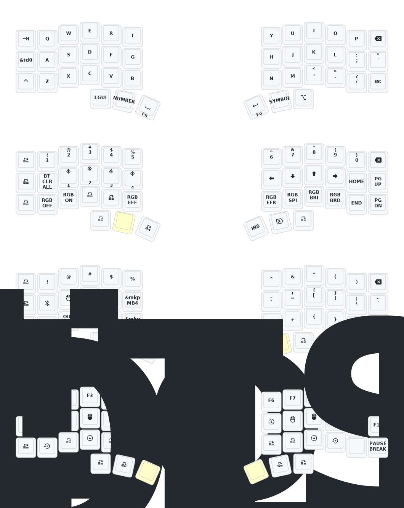

- [中文](README.md)
- [English](README_EN.md)

# 更新列表

- 2024/12/21
  1. 增加zmk-studio支持（只需要刷新左手即可使用）。
- 2024/10/24
  1. 修改供电模式，功耗降低。
  2. 修正RGB供电自动关闭的功能。

> 如果您的键盘于10月24日之前更新，请更新最新的固件。
> 
---
# 联系我

如需3D打印的模型文件或者键盘有任何异常和故障，请联系380465425@qq.com

# Corne键位图

